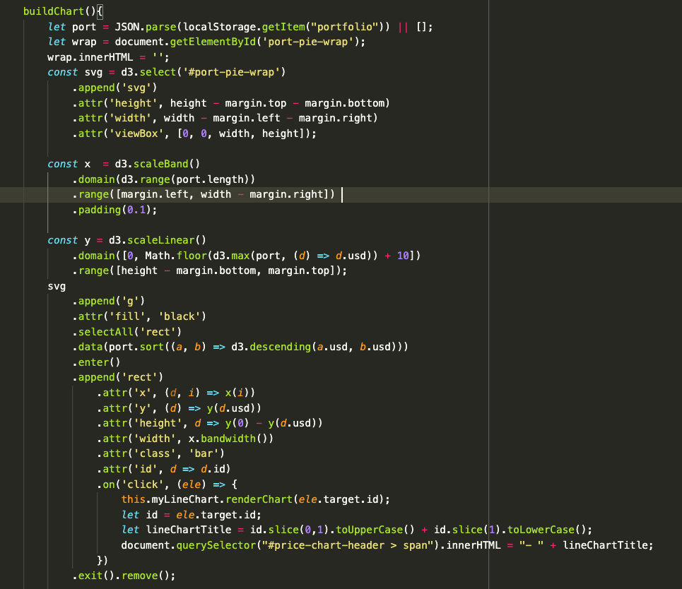

<h1>Cryptolio</h1>
<a href="https://domswaby.github.io/js-project">Cryptolio</a> allows users to quickly build and visualize a cryptocurrency portfolio by searching for and adding cryptocurrencies, and entering the quantity held of each coin. 

<h2>Functionality:</h2>
Users are be able to: 
<h3>1. Search for and select a wide range of cryptos to add to their portfolio</h3>

<h3>2. Enter and store quantities for each coin added.</h3>
3. View the generated bar chart for a proportional view of coins in the portfolio.</h3>

  
<h3>4. View historical price of the selected coin bar in a line chart.</h3>
 

Libraries and Apis: 
1. D3 is used to render the data visualizations.  
2. The coingecko API is used for fetching the necessary crypto data. 

<h2>Future Implementations</h2> 

1. Add extra fields to the portfolio table to allow user to save information about buy and sell dates.
2. Click on different parts of the line chart in order to save information about buy and sell dates.  
3. Calculate profit and loss from information about buy and sell dates in combination with historical price data.

